# VOID OS — Entity Relationship Diagram

Tài liệu này mô tả quan hệ dữ liệu dự kiến của VOID OS V1.

> Đây là bản thiết kế logic. Một số cột kỹ thuật, index, trigger và RLS sẽ được bổ sung trong migration.

```mermaid
erDiagram

    ORGANIZATIONS {
        uuid id PK
        text code
        text name
        enum status
        timestamptz created_at
        timestamptz updated_at
        timestamptz deleted_at
    }

    ORGANIZATION_MEMBERS {
        uuid id PK
        uuid organization_id FK
        uuid user_id FK
        enum role
        enum status
    }

    EMPLOYEE_POSITIONS {
        uuid id PK
        uuid organization_id FK
        text code
        text name
    }

    EMPLOYEES {
        uuid id PK
        uuid organization_id FK
        uuid organization_member_id FK
        uuid position_id FK
        text code
        text full_name
        enum employee_type
        enum status
    }

    CUSTOMERS {
        uuid id PK
        uuid organization_id FK
        text code
        text display_name
        enum customer_type
        enum status
    }

    CONTACTS {
        uuid id PK
        uuid customer_id FK
        text full_name
        text phone
        text email
        boolean is_primary
    }

    CUSTOMER_ADDRESSES {
        uuid id PK
        uuid customer_id FK
        text address_type
        text address_line
        boolean is_default
    }

    PROJECTS {
        uuid id PK
        uuid organization_id FK
        uuid customer_id FK
        text code
        text name
        enum project_type
        enum status
        date start_date
        date expected_end_date
    }

    PROJECT_PHASES {
        uuid id PK
        uuid project_id FK
        text name
        integer sort_order
        enum status
        date start_date
        date due_date
    }

    PROJECT_MEMBERS {
        uuid id PK
        uuid project_id FK
        uuid employee_id FK
        enum role
        boolean is_active
    }

    MILESTONES {
        uuid id PK
        uuid project_id FK
        uuid project_phase_id FK
        text title
        enum status
        date due_date
    }

    TASKS {
        uuid id PK
        uuid project_id FK
        uuid project_phase_id FK
        uuid milestone_id FK
        uuid assignee_employee_id FK
        text title
        enum status
        enum priority
        date due_date
    }

    PROJECT_STATUS_HISTORY {
        uuid id PK
        uuid project_id FK
        enum previous_status
        enum new_status
        uuid changed_by FK
        timestamptz changed_at
    }

    QUOTATIONS {
        uuid id PK
        uuid organization_id FK
        uuid project_id FK
        text code
        enum status
    }

    QUOTATION_VERSIONS {
        uuid id PK
        uuid quotation_id FK
        integer version_number
        enum status
        numeric subtotal
        numeric discount_amount
        numeric tax_amount
        numeric total_amount
    }

    QUOTATION_ITEMS {
        uuid id PK
        uuid quotation_version_id FK
        uuid parent_item_id FK
        enum item_type
        text description
        numeric quantity
        numeric unit_price
        numeric total_amount
    }

    CONTRACTS {
        uuid id PK
        uuid organization_id FK
        uuid project_id FK
        uuid quotation_version_id FK
        text code
        enum status
        numeric contract_value
    }

    PAYMENT_SCHEDULES {
        uuid id PK
        uuid contract_id FK
        integer phase_number
        numeric percentage
        numeric planned_amount
        date due_date
        enum status
    }

    PAYMENTS {
        uuid id PK
        uuid payment_schedule_id FK
        numeric paid_amount
        date paid_date
        enum payment_method
        enum status
    }

    WORK_CATEGORIES {
        uuid id PK
        uuid organization_id FK
        uuid parent_id FK
        text code
        text name
    }

    UNITS {
        uuid id PK
        uuid organization_id FK
        text code
        text name
        text symbol
    }

    MATERIALS {
        uuid id PK
        uuid organization_id FK
        uuid default_unit_id FK
        text code
        text name
        text brand
        enum status
    }

    SUPPLIERS {
        uuid id PK
        uuid organization_id FK
        text code
        text name
        enum status
    }

    PROJECT_BUDGETS {
        uuid id PK
        uuid project_id FK
        integer version_number
        enum status
        numeric total_estimated_cost
        boolean is_approved
    }

    PROJECT_BUDGET_ITEMS {
        uuid id PK
        uuid project_budget_id FK
        uuid parent_item_id FK
        uuid work_category_id FK
        uuid material_id FK
        uuid unit_id FK
        text description
        numeric quantity
        numeric estimated_unit_cost
        numeric estimated_total
    }

    PURCHASE_ORDERS {
        uuid id PK
        uuid organization_id FK
        uuid project_id FK
        uuid supplier_id FK
        text code
        enum status
        numeric total_amount
    }

    PURCHASE_ORDER_ITEMS {
        uuid id PK
        uuid purchase_order_id FK
        uuid project_budget_item_id FK
        uuid material_id FK
        uuid unit_id FK
        text description
        numeric quantity
        numeric unit_price
        numeric total_amount
    }

    EXPENSE_CATEGORIES {
        uuid id PK
        uuid organization_id FK
        uuid parent_id FK
        text code
        text name
    }

    PROJECT_EXPENSES {
        uuid id PK
        uuid organization_id FK
        uuid project_id FK
        uuid supplier_id FK
        uuid expense_category_id FK
        uuid project_budget_item_id FK
        uuid purchase_order_id FK
        uuid purchase_order_item_id FK
        numeric amount
        numeric paid_amount
        enum status
    }

    OFFICE_EXPENSES {
        uuid id PK
        uuid organization_id FK
        uuid expense_category_id FK
        numeric amount
        numeric paid_amount
        enum status
        date expense_date
    }

    DOCUMENT_CATEGORIES {
        uuid id PK
        uuid organization_id FK
        uuid parent_id FK
        text code
        text name
        boolean is_active
    }

    DOCUMENTS {
        uuid id PK
        uuid organization_id FK
        uuid document_category_id FK
        text code
        text title
        enum status
        enum visibility
        enum source
        uuid current_version_id FK
    }

    DOCUMENT_VERSIONS {
        uuid id PK
        uuid organization_id FK
        uuid document_id FK
        integer version_number
        enum status
        text storage_bucket
        text storage_path
        text mime_type
        bigint file_size_bytes
    }

    DOCUMENT_LINKS {
        uuid id PK
        uuid organization_id FK
        uuid document_id FK
        enum attachment_role
        uuid customer_id FK
        uuid supplier_id FK
        uuid project_id FK
        uuid quotation_id FK
        uuid contract_id FK
        uuid payment_id FK
        uuid purchase_order_id FK
        uuid project_expense_id FK
        uuid office_expense_id FK
        uuid financial_transaction_id FK
    }

    DOCUMENT_ACCESS_GRANTS {
        uuid id PK
        uuid organization_id FK
        uuid document_id FK
        uuid user_id FK
        uuid contact_id FK
        enum access_level
    }

    FOLDERS {
        uuid id PK
        uuid organization_id FK
        uuid project_id FK
        uuid parent_folder_id FK
        text name
    }

    FILES {
        uuid id PK
        uuid organization_id FK
        uuid project_id FK
        uuid folder_id FK
        text name
        text storage_path
        enum status
    }

    FILE_VERSIONS {
        uuid id PK
        uuid file_id FK
        integer version_number
        text storage_path
        bigint file_size
    }

    ATTACHMENTS {
        uuid id PK
        uuid organization_id FK
        uuid file_id FK
        text entity_type
        uuid entity_id
    }

    ACTIVITY_LOGS {
        uuid id PK
        uuid organization_id FK
        uuid actor_user_id FK
        text entity_type
        uuid entity_id
        text action
        jsonb changes
    }

    NOTIFICATIONS {
        uuid id PK
        uuid organization_id FK
        uuid recipient_user_id FK
        enum notification_type
        enum status
        text title
    }

    TIMELINE_EVENTS {
        uuid id PK
        uuid organization_id FK
        uuid project_id FK
        uuid actor_user_id FK
        enum event_type
        text title
        timestamptz occurred_at
    }

    ORGANIZATIONS ||--o{ ORGANIZATION_MEMBERS : has
    ORGANIZATIONS ||--o{ EMPLOYEE_POSITIONS : defines
    ORGANIZATIONS ||--o{ EMPLOYEES : employs

    ORGANIZATION_MEMBERS o|--o| EMPLOYEES : may_link_to
    EMPLOYEE_POSITIONS o|--o{ EMPLOYEES : assigned_to

    ORGANIZATIONS ||--o{ CUSTOMERS : owns
    CUSTOMERS ||--o{ CONTACTS : has
    CUSTOMERS ||--o{ CUSTOMER_ADDRESSES : has

    ORGANIZATIONS ||--o{ PROJECTS : owns
    CUSTOMERS ||--o{ PROJECTS : commissions

    PROJECTS ||--o{ PROJECT_PHASES : contains
    PROJECTS ||--o{ PROJECT_MEMBERS : has
    EMPLOYEES ||--o{ PROJECT_MEMBERS : assigned

    PROJECTS ||--o{ MILESTONES : contains
    PROJECT_PHASES o|--o{ MILESTONES : groups

    PROJECTS ||--o{ TASKS : contains
    PROJECT_PHASES o|--o{ TASKS : groups
    MILESTONES o|--o{ TASKS : includes
    EMPLOYEES o|--o{ TASKS : assigned

    PROJECTS ||--o{ PROJECT_STATUS_HISTORY : records

    PROJECTS ||--o{ QUOTATIONS : receives
    QUOTATIONS ||--o{ QUOTATION_VERSIONS : versions
    QUOTATION_VERSIONS ||--o{ QUOTATION_ITEMS : contains
    QUOTATION_ITEMS o|--o{ QUOTATION_ITEMS : groups

    PROJECTS ||--o{ CONTRACTS : has
    QUOTATION_VERSIONS o|--o| CONTRACTS : approved_as

    CONTRACTS ||--o{ PAYMENT_SCHEDULES : defines
    PAYMENT_SCHEDULES ||--o{ PAYMENTS : receives

    ORGANIZATIONS ||--o{ WORK_CATEGORIES : defines
    WORK_CATEGORIES o|--o{ WORK_CATEGORIES : parent_of

    ORGANIZATIONS ||--o{ UNITS : defines
    ORGANIZATIONS ||--o{ MATERIALS : owns
    UNITS o|--o{ MATERIALS : default_unit

    ORGANIZATIONS ||--o{ SUPPLIERS : owns

    PROJECTS ||--o{ PROJECT_BUDGETS : versions
    PROJECT_BUDGETS ||--o{ PROJECT_BUDGET_ITEMS : contains
    PROJECT_BUDGET_ITEMS o|--o{ PROJECT_BUDGET_ITEMS : groups
    WORK_CATEGORIES o|--o{ PROJECT_BUDGET_ITEMS : categorizes
    MATERIALS o|--o{ PROJECT_BUDGET_ITEMS : references
    UNITS o|--o{ PROJECT_BUDGET_ITEMS : measures

    PROJECTS ||--o{ PURCHASE_ORDERS : has
    SUPPLIERS ||--o{ PURCHASE_ORDERS : receives
    PURCHASE_ORDERS ||--o{ PURCHASE_ORDER_ITEMS : contains
    PROJECT_BUDGET_ITEMS o|--o{ PURCHASE_ORDER_ITEMS : compares
    MATERIALS o|--o{ PURCHASE_ORDER_ITEMS : orders
    UNITS o|--o{ PURCHASE_ORDER_ITEMS : measures

    ORGANIZATIONS ||--o{ EXPENSE_CATEGORIES : defines
    EXPENSE_CATEGORIES o|--o{ EXPENSE_CATEGORIES : parent_of

    PROJECTS ||--o{ PROJECT_EXPENSES : incurs
    SUPPLIERS o|--o{ PROJECT_EXPENSES : payable_to
    EXPENSE_CATEGORIES o|--o{ PROJECT_EXPENSES : categorizes
    PROJECT_BUDGET_ITEMS o|--o{ PROJECT_EXPENSES : compares
    PURCHASE_ORDERS o|--o{ PROJECT_EXPENSES : generates
    PURCHASE_ORDER_ITEMS o|--o{ PROJECT_EXPENSES : generates

    ORGANIZATIONS ||--o{ OFFICE_EXPENSES : incurs
    EXPENSE_CATEGORIES ||--o{ OFFICE_EXPENSES : categorizes

    ORGANIZATIONS ||--o{ DOCUMENT_CATEGORIES : defines
    DOCUMENT_CATEGORIES o|--o{ DOCUMENT_CATEGORIES : parent_of
    ORGANIZATIONS ||--o{ DOCUMENTS : owns
    DOCUMENT_CATEGORIES o|--o{ DOCUMENTS : classifies
    DOCUMENTS ||--o{ DOCUMENT_VERSIONS : versions
    DOCUMENTS o|--o| DOCUMENT_VERSIONS : current_version
    DOCUMENTS ||--o{ DOCUMENT_LINKS : links_to
    CUSTOMERS o|--o{ DOCUMENT_LINKS : linked_as
    SUPPLIERS o|--o{ DOCUMENT_LINKS : linked_as
    PROJECTS o|--o{ DOCUMENT_LINKS : linked_as
    QUOTATIONS o|--o{ DOCUMENT_LINKS : linked_as
    CONTRACTS o|--o{ DOCUMENT_LINKS : linked_as
    PAYMENTS o|--o{ DOCUMENT_LINKS : linked_as
    PURCHASE_ORDERS o|--o{ DOCUMENT_LINKS : linked_as
    PROJECT_EXPENSES o|--o{ DOCUMENT_LINKS : linked_as
    OFFICE_EXPENSES o|--o{ DOCUMENT_LINKS : linked_as
    FINANCIAL_TRANSACTIONS o|--o{ DOCUMENT_LINKS : linked_as
    DOCUMENTS ||--o{ DOCUMENT_ACCESS_GRANTS : grants
    ORGANIZATION_MEMBERS o|--o{ DOCUMENT_ACCESS_GRANTS : grants_to
    CONTACTS o|--o{ DOCUMENT_ACCESS_GRANTS : grants_to

    ORGANIZATIONS ||--o{ FOLDERS : owns
    PROJECTS o|--o{ FOLDERS : contains
    FOLDERS o|--o{ FOLDERS : parent_of

    ORGANIZATIONS ||--o{ FILES : owns
    PROJECTS o|--o{ FILES : contains
    FOLDERS o|--o{ FILES : stores
    FILES ||--o{ FILE_VERSIONS : versions

    FILES ||--o{ ATTACHMENTS : attached_as
    ORGANIZATIONS ||--o{ ATTACHMENTS : owns

    ORGANIZATIONS ||--o{ ACTIVITY_LOGS : records
    ORGANIZATIONS ||--o{ NOTIFICATIONS : sends
    ORGANIZATIONS ||--o{ TIMELINE_EVENTS : records
    PROJECTS o|--o{ TIMELINE_EVENTS : contains
```



## Relationship rules

### Organization ownership

Các bảng cấp cao phải có `organization_id` trực tiếp:

- customers
- employees
- projects
- quotations
- contracts
- suppliers
- purchase_orders
- project_expenses
- office_expenses
- files

Các bảng con có thể kế thừa organization qua bảng cha:

- contacts → customers
- quotation_versions → quotations
- quotation_items → quotation_versions
- payment_schedules → contracts
- payments → payment_schedules
- purchase_order_items → purchase_orders
- file_versions → files

### Quotation versioning

Một mã báo giá có nhiều phiên bản:

```text
quotation
└── quotation_versions
    ├── V1
    ├── V2
    └── V3 — approved
```

Các dòng báo giá thuộc `quotation_version`, không thuộc trực tiếp `quotation`.

### Project budgets

Một dự án có thể có nhiều bản dự toán, nhưng chỉ một bản được duyệt tại một thời điểm.

```text
project
└── project_budgets
    ├── V1
    ├── V2
    └── V3 — approved
```

### Project expenses

`project_expenses` là dữ liệu chi phí thực tế.

Một khoản chi có thể:

- Phát sinh độc lập.
- Liên kết một dòng dự toán.
- Liên kết đơn đặt hàng.
- Liên kết một dòng trong đơn đặt hàng.
- Liên kết nhà cung cấp.

### Document storage

File thực tế nằm trong Supabase Storage.

Database chỉ lưu:

- Tên file.
- Đường dẫn storage.
- Metadata.
- Phiên bản.
- Quan hệ với dự án hoặc đối tượng nghiệp vụ.

### Source of truth

Không lưu trực tiếp những số tổng hợp có thể tính lại:

- Doanh thu thực tế → tính từ payments.
- Chi phí dự án thực tế → tính từ project_expenses.
- Công nợ khách hàng → payment_schedules trừ payments.
- Công nợ nhà cung cấp → project_expenses trừ paid_amount.
- Lợi nhuận gộp dự án → doanh thu trừ chi phí dự án.